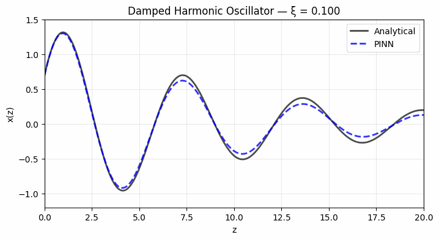

# PINN for the Damped Harmonic Oscillator

**Test task for [ML4Sci - Physics-Informed Neural Network Diffusion Equation (PINNDE)](https://ml4sci.org/gsoc/2025/proposal_GENIE5.html)**  
Physics‑Informed Neural Network conditioned on damping ratio ξ to solve a family of ODEs with one model.

<p align="center">
  
</p>

## Problem Statement

Solve the damped harmonic oscillator:

$$\frac{d^2 x}{dz^2} + 2\xi\frac{dx}{dz} + x = 0, \quad x(0)=0.7,\; \dot{x}(0)=1.2$$

on z ∈ [0, 20] and ξ ∈ [0.1, 0.4].  
The PINN takes (z, ξ) → x and learns the whole solution family in one network.
ξ is treated as an input parameter here, analogous to spatial coordinates (x, y, z) in the diffusion PINN.  
Fourier features are a practical fix for multi‑scale behavior in both problems.

## Approach

- **Model I/O:** MLP with (z, ξ) input and scalar x output  
- **Physics loss:** ODE residual at collocation points  
- **IC loss:** enforce x(0)=0.7 and ẋ(0)=1.2 across ξ  
- **Fourier features:** learnable sinusoidal embedding of z for sharper oscillations  
- **Optimizer:** Adam + cosine LR schedule

## Results

Results are extracted form the python notebook, running on a T4 GPU and takes ~30min.  
Lower ξ is more oscillatory, so it benefits most from Fourier features.

| ξ    | Rel L2 (baseline) | Rel L2 (Fourier) | Rel L2 (GELU + Fourier) |
|------|--------------------|-----------------|--------------------------|
| 0.10 | 36.03%             | 30.79%          | 9.51%                    |
| 0.20 | 8.94%              | 5.64%           | 2.21%                    |
| 0.30 | 3.59%              | 5.59%           | 1.03%                    |
| 0.40 | 7.14%              | 10.33%          | 2.03%                    |

Key results in the notebook:
- Curve match against analytical solution
- Residual heatmap over (z, ξ)
- Phase portraits for physical correctness
- Generalization to unseen ξ values

## Reproduce

```bash
pip install -r requirements.txt
jupyter notebook pinn_oscillator.ipynb
```

## Files

```
utils.py               ← Model, losses, training, evaluation, plotting
pinn_oscillator.ipynb  ← Main experiment notebook
figures/               ← Saved plots and GIF
requirements.txt       ← Dependencies
```

## References

1. Raissi, Perdikaris, Karniadakis. *Physics‑informed neural networks.* J. Comp. Phys., 2019.  
2. Tancik et al. *Fourier Features Let Networks Learn High Frequency Functions in Low Dimensional Domains.* NeurIPS, 2020.  
3. Wang, Teng, Perdikaris. *Understanding and Mitigating Gradient Flow Pathologies in PINNs.* SIAM J. Sci. Comp., 2021.
